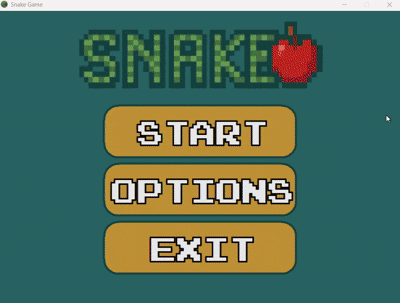

# Snake Game in C (Windows API)

[](LICENSE)


This is a simple **Snake game** coded in pure **C** using the **Windows API** — no external libraries used.  
Rendering is currently done using **GDI objects**, like `Rectangle` and `Ellipse`, and the snake is implemented as a **linked list**.  
Right now, it’s all about the basics — more sprite support yet to come.

---

## Features

- Classic Snake gameplay
- Pure Win32 API (no SDL, no OpenGL, no dependencies)
- Snake and pellet rendered using GDI objects and custom functions
- Animated Sprite pellet
- Snake body handled with a linked list
- Collision detection with pellets
- Node-freeing system with logging (see below)
- restart Game

---

## Node Cleanup + Logging

When the game quits (or when restart is added later), each segment of the snake is **freed from memory**, and a log is created:

- The log shows the **timestamp** and **number of freed nodes**
- If the log file can’t be opened, cleanup still happens — no leak, just no log

**Example `log.txt` entry:**
```
Log date and time : [Mon Apr 07 10:45:15 2025]

freeing node with coord (5, 17) (node: 1)
freeing node with coord (5, 16) (node: 2)
freeing node with coord (5, 15) (node: 3)
freeing node with coord (5, 14) (node: 4)
freeing node with coord (5, 13) (node: 5)
freeing node with coord (5, 12) (node: 6)
freeing node with coord (5, 11) (node: 7)
freeing node with coord (5, 10) (node: 8)

log :
8 nodes was freed.
```

---

## Limitations (for now)

- No sound effect

---

## How to Play

1. **Clone the repo**  
   Or just download the ZIP and extract:
   ```bash
   git clone https://github.com/gtRZync/snake-game-winapi.git
   ```

2. **Open the folder in VSCode**

3. **Press `CTRL + SHIFT + B`**  
   This runs the `tasks.json` build task and compiles the game.

4. **Run the game**  
   Navigate to the `bin/` folder and double-click:
   ```
   snake_game.exe
   ```

---

## Controls

- **Arrow Keys** — Move the snake
- **ESC** — Exit the game

---

## Gameplay

  

---

## Coming Soon

- More sprite-based graphics
- Sound effects?

---

## License

This project is licensed under the [GPL v3 License](LICENSE).